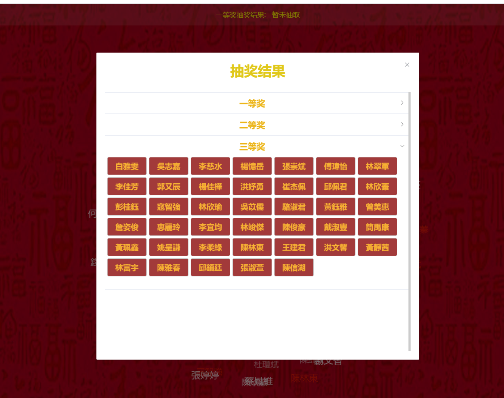

## 年会抽奖程序

基于 [lucky-draw](https://github.com/vitozyf/lucky-draw) 修改

#### 修改内容有

- 导入名单完成后，将抽奖总人数设置为当前名单总人数
- 点击停止后的抽奖结果及查询抽奖结果时，将原有的编码改为姓名，方便用户观看
- 点击停止后的抽奖结果及查询抽奖结果页面调整容器为上下滚动，
  并适应当前窗口，防止其超出页面窗口
- 修改页面背景，改为红色背景
- 头部抽奖结果的滚动条显示同样将编码改为对应用户姓名，方便观看
- 将主色调改为金黄色

### 截图

## 温馨提示

- 本抽奖程序无暗箱操作，无后台，无后门。
- 名单和照片显示只需导入一种即可,无导入数据则使用抽奖号码。
- 建议使用最新的 Chrome 浏览器打开体验最佳。
- 由于背景音乐加载较慢，可以在抽奖前提前打开缓存好。或者安装 windows 版本软件到本地，无需联网即可使用。

## windows 软件版本

- 本抽奖程序的 windows 软件版本下载[安装包](https://github.com/vitozyf/lucky-draw/releases/tag/0.0.1)

## License

[MIT](https://choosealicense.com/licenses/mit/)
